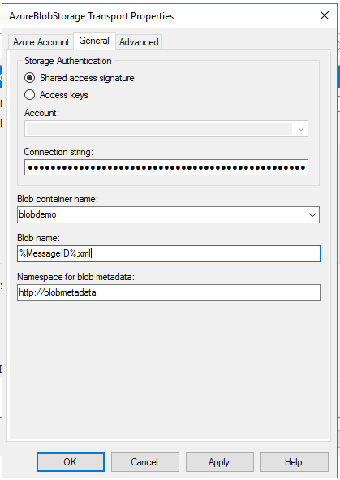
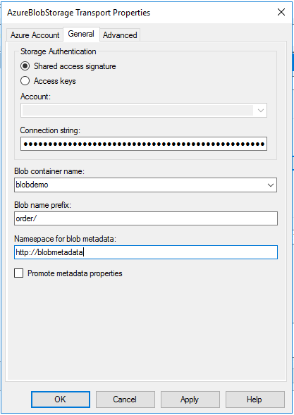

# Azure Blob storage adapter in BizTalk

## Overview
**Starting with BizTalk Server 2020**, you can send and receive messages between BizTalk Server and Azure Blob storage. 

Azure Blob storage is Microsoft's object storage solution for the cloud, which is optimized for storing massive amounts of unstructured data. [What is Azure Blob storage?](https://docs.microsoft.com/azure/storage/blobs/storage-blobs-overview) provides more details.

## Prerequisites

* Create an [Azure blob storage account](https://docs.microsoft.com/azure/storage/common/storage-create-storage-account)  with a container

## Send messages to Azure Blob storage

1.  In the BizTalk Server Administration console, right-click **Send Ports**, select **New**, and select **Static One-way send port**.

    [Create a Send Port](../core/how-to-create-a-send-port2.md) provides some guidance.

2. Enter a **Name**. In **Transport**, set the **Type** to **AzureBlobStorage**, and click **Configure** button. 

3. Configure the **Azure Account** properties.
>[!NOTE]
>After sign into your Azure subscription, adapter configuration dialog can automatically list the Azure resources, which make adapter configuration easier. But it is not essensial, user can configure adapter properties without owning any Azure subscription. 

    |Use this|To do this|  
    |---|---|  
    | **Sign-in** | Sign into your Azure account |
    | **Subscription** | Select the subscription that has your Azure storage account |
    | **Resource Group** | Select your resource group that has your Azure storage account |

4. Configure the **General** properties: 

    |Use this|To do this|  
    |---|---|  
    | **Storage Authentication** | Select an authentication method. <ul><li>Typically, it's recommended to use a Shared Access Signature, which is also selected by default. You can input the Shared Access Signature connection string in the **Connection string** field to provide the authentication.</li> <li>If you are using Access keys as authentication method, a collection of storage account will be populated up in **Account** drop-down list. After you select the storage account, **Connection string** field will be automatically populated with your primary access key, which also known as **key1**. </li></ul><br />The following links are good resources to help you decide which authentication method is right for your scenario:<br/><br/>[Authorizing access to data in Azure Storage](https://docs.microsoft.com/azure/storage/common/storage-auth)<br/>[Using shared access signatures (SAS)](https://docs.microsoft.com/azure/storage/common/storage-dotnet-shared-access-signature-part-1) |
    | **Blob container name** | Select the name of your Blob container from the drop-down list. The list should be auto-populated after the **Connection string** field is filled up. |
    | **Blob name** | Specify name of the blob used by the adapter to upload the message to Blob storage container. Macros can be used for Blob name, similar to file name property of file adapter. For available Macros please refer to [Using macros in file names](restrictions-when-configuring-the-file-adapter.md#using-macros-in-file-names). |
    | **Namespace for blob metadata** | Specify namespace as a filter. Context properties of the message will be written to blob metadata if the namespace of the property match this field. |

    When finished, your properties look similar to the following: 

    

5. Configure the **Advanced** properties:

    |Use this|To do this|  
    |---|---|  
    |**Blob type**| Specify **Blob type** adapter will upload message as, visit [blob types](https://docs.microsoft.com/en-us/azure/storage/blobs/storage-blobs-introduction) for more information. |
    |**Write mode**| Specify **Write mode** adapter will use in case of give **Blob name** already exists. 	<ul><li>Create new: Adapter will always try to create new blob, if blob with same path already exists, error will be thrown into event view. And message will be suspended. </li><li>Overwrite: Adapter will overwrite if blob with same path already exists, metadata will be overwritten as well.</li><li>Append: Adapter will append to exists blob if it has same path,notice only new content(from message body) will be appended, metadata will not change.</li></ul>|  

6. Select **Ok** to save your changes. 


### Test your send port

You can use a simple File receive port and location to send messages to your Azure Blob storage. 

1. Create a receive port named "FileReceivePort" using the File adapter. Within your receive location,  set the **Receive folder** to **C:\Temp\In\\**, and set the file mask to **\*.xml**.
2. In your Azure Blob storage send port properties, set the **Filters** to `BTS.ReceivePortName == FileReceivePort`.
3. Paste the following into a text editor, and save the file as **AzureBlobStorageMessage.xml**. This is your sample message. 

    ```xml
    <Data>
      <DataID>DataID_0</DataID>
      <DataDetails>DataDetails_0</DataDetails>
    </Data>
    ```

4. Start the File receive location and the Azure Blob storage send port.
5. Copy **AzureBlobStorageMessage.xml** sample message into the receive folder (C:\Temp\In\). The send port sends the XML file to the Azure Blob storage. You can verify that by looking into your Azure storage container and examin the new created or updated file.

## Receive messages from Azure Blob storage

1. In the BizTalk Server Administration console, right-click **Receive Ports**, select **New**, and select **One-Way receive port**. 

    [Create a receive port](../core/how-to-create-a-receive-port.md) provides some guidance.

2. Enter a name, and select **Receive Locations**. 

3. Select **New**, and **Name** the receive location. In **Transport**, select **AzureBlobStorage** from the **Type** drop-down list, and then click **Configure** button. 

4. Configure the **Azure Account** properties: 

    |Use this|To do this|  
    |---|---|  
    | **Sign-in** | Sign into your Azure account |
    | **Subscription** | Select the subscription that has your Azure storage account |
    | **Resource Group** | Select your resource group that has your Azure storage account |

5. Configure the **General** properties: 

    |Use this|To do this|  
    |---|---|  
    | **Storage Authentication** | Select an authentication method. <ul><li>Typically, it's recommended to use a Shared Access Signature, which is also by default selected. You can input the Shared Access Signature connection string to **Connection string** field to provide the authentication.</li> <li>If you are using Access keys as authentication method, a collection of storage account will be poped up in **Account** drop-down list, after you select the storage account, **Connection string** field will be automatically filled up using your primary access key, which also know as **key1**. </li></ul><br />The  The following links are good resources to help you decide which is right for your scenario:<br/><br/>[About Azure storage accounts](https://docs.microsoft.com/azure/storage/common/storage-create-storage-account)<br/>[Using shared access signatures (SAS)](https://docs.microsoft.com/azure/storage/common/storage-dotnet-shared-access-signature-part-1) |
    | **Blob container name** | Select the name of your Blob container from the drop-down list which should be automatically manipulated after the **Connection string** field is filled up. |
    | **Blob name prefix** | Specify a prefix for the blob you want to receive, for example if "order/" is used for **Blob name prefix**, then receive location will only pick up the files in "order" folder. |
    | **Namespace for blob metadata** | Specify a namespace when adapter creating context properties from custom blob metadata when it receiving the blob content. |
    | **Promote metadata properties** | Specify whether custom blob metadata will be promoted or not. |

    > [!NOTE]
    > All standard blob properties like Blob Uri, Name, BLobType are brought into BizTalk as properties(not promoted) with "http://schemas.microsoft.com/BizTalk/Adapter/AzureStorage-properties" as namespace.

    When finished, your properties look similar to the following: 

    

6. Configure the **Advanced** properties: 

    |Use this|To do this|  
    |---|---|  
    | **Polling interval** | Specify the polling interval for Azure Blob storage receive adapter. |
    | **Maximum messages per batch** | Specify batch size adapter will submit messages into BizTalk.|
    | **Parallel downloads** | Specify parrellel maximum blobs allowed to be downloaded.|
    | **Error threshold** | Specify error threshold, receive location will be disabled after error threshold hit. |


7. Select **Ok** to save your changes. 

### Test your receive settings

You can use a simple File send port to receive messages from your Azure Blob storage. 

1. Create a send port using the File adapter. Within your send port properties, set the **Destination folder** to **C:\Temp\Out\\**, and set the and **File name** to **%MessageID%.xml**.
2. In your File send port properties, set the **Filters** to  `BTS.ReceivePortName == BlobReceivePort`.
3. Create a receive port named "BlobReceivePort", and create an Azure Blob storage receive location within, then start it.
4. Upload an file to the specified blob container match the blob prefix in Azure portal, look for messages in the destination folder (c:\temp\out).

> [!IMPORTANT]
> Azure Blob storage receive adapter will delete the blob after it is submitted into BizTalk MessageBox.

## High Availability of Azure Blob storage adapter

Azure Blob storage receive adapter supports receiving high-availability. Add multiple host instances into same Azure Blob storage adapter receive handler, and they can receive from same blob container simultaneously. Blob lease is used as a lock to avoid same blob being received by multiple host instances.

Visit [Pessimistic concurrency for blobs
](https://docs.microsoft.com/en-us/azure/storage/common/storage-concurrency#pessimistic-concurrency-for-blobs) to understand more Azure blob lease.

Azure Blob storage send adapter like most of other send adapters, provides hight availability for the sending host by just having multiple host instances in the same sending host.