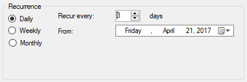
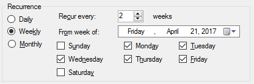
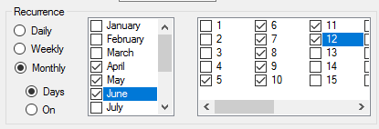

# Configure the time zone and recurrence scheduling in BizTalk Server
Set the timezone and configure a recurrence schedule on your receive locations in [!INCLUDE[btsBizTalkServerNoVersion_md](../includes/btsbiztalkservernoversion-md.md)]. 

**Starting with [!INCLUDE[bts2016_md](../includes/bts2016-md.md)] [!INCLUDE[featurepack1](../includes/featurepack1.md)]**, the advanced scheduling feature on receive locations includes some options. Using the advanced scheduling options, set the time zone, and also set a recurrence schedule.

This topic shows you how to configure these features.

## Prerequisites
Install [Feature Pack 2](https://aka.ms/bts2016fp2) on your [!INCLUDE[btsBizTalkServerNoVersion_md](../includes/btsbiztalkservernoversion-md.md)].

## Time zone

The **Schedule** properties of a receive location includes a **Time Zone** property. When set, the time zone you choose in the receive location is used instead of the time zone on the local computer. 

All dates and times in the **Schedule** properties are specific to the time zone you choose. Any existing schedules are migrated to the time zone of the server hosting the BizTalk Management database (BizTalkMgmtDb). 

You can also adjust for daylight saving time (DST). When checked, the schedule automatically adjusts to the daylight saving time of the time zone you choose. This option has no impact on the schedule if:

* The specified time zone does not have a daylight saving time
* Daylight saving time is not observed in the time zone you choose

## Enable recurrence schedule
1. In the **BizTalk Server Administration** console, right-click one of your receive locations, and select **Properties**. 
2. On the **Scheduling** page, select **Enable service window**. The **Start Time** and **Stop time** set the initial time the schedule is allowed to run:

    

3. The additional scheduling options are displayed:

    

4. The **Recurrence** property runs the receive port every day, week, or month that you choose: 

    1. Use the **Daily** recurrence to run the receive port every *x* number of days, starting on the **From** date you choose, and only within the **service window** you choose:

        

    2. Use the **Weekly** recurrence to run the receive port on a specific day within a week, and only within the **service window** you choose: 

        

    3. Use the **Monthly** recurrence to run the receive port on a monthly schedule. The **Days** and **On** options are available. 
	
        Use the **Days** recurrence to run the receive port on specific dates within the **months** you choose: 

        

        Use the **On** recurrence to run the receive port on on specific days of the month:

        

5. Select **OK** to save your changes. 

## See also
[Configure the Feature Pack](../core/configure-the-feature-pack.md)