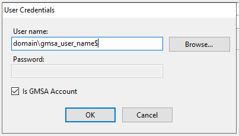
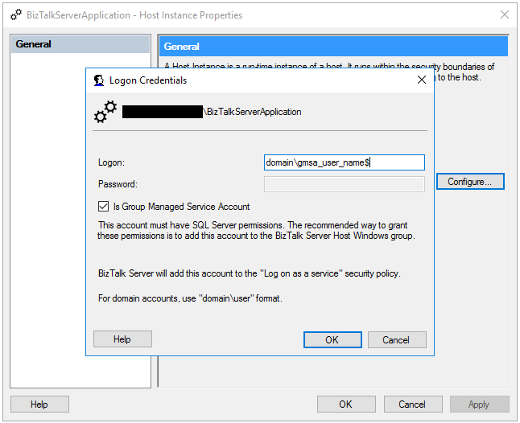

# Using Group Managed Service Account for BizTalk Server Features

BizTalk Server 2020 and newer supports [Group Managed Service Accounts (gMSA)](/windows-server/security/group-managed-service-accounts/group-managed-service-accounts-overview).

When using gMSA, users continue to run BizTalk services without changing the service passwords. The following table shows the BizTalk Server features that support gMSA:

| Feature | Supported |
| --- | --- |
| Enterprise SSO | No |
| Group | N/A |
| BizTalk Runtime | Yes |
| Business Rules Engine | Yes |
| BAM Tools | Yes (for Bam Alerts) |
| BAM Portal | Only for Application Pool Account |
| BizTalk EDI/AS2 Runtime | N/A |
| Rest API | Yes |
| BizTalk TMS | Yes |

New installations of BizTalk Server may be configured with gMSA by running BizTalk Server Custom Configuration.

> [!NOTE]
> gMSA isn't available with a Basic Configuration.

When you run BizTalk Server Custom Configuration, the features that support gMSA have a **Is gMSA account** setting. When this setting is checked, the password property disables. Be sure the user name is set to the correct gMSA.

> [!div class="mx-imgBorder"]
> 

Users upgrading to BizTalk Server 2020 can use the information in this article to configure individual features with gMSA.

## BizTalk Runtime

Users can update logon information using the BizTalk Server Administration console.

1. In BizTalk Server Administration, go to **Platform Settings** > **Host Instances**.
2. Open the host instance you want to change to gMSA.
3. Select the **Configure** button. Enter the logon account, and select **Is Group Managed Service Account**:

    > [!div class="mx-imgBorder"]
    > 

## Business Rules Engine, BAM Alerts, and BizTalk TMS

Users can update the **Rule Engine Update Service**, **BAMAlerts**, and **BizTalk TMS** services to use gMSA. To change the logon, use **[SC config](/windows-server/administration/windows-commands/sc-config)** or the **Services** app.

## BAM Portal and Rest API

The BAM portal and REST APIs create application pools in IIS. The identity of each of these app pools can be changed to use gMSA.

## Next steps

[Configure BizTalk Server](../install-and-config-guides/configure-biztalk-server.md).