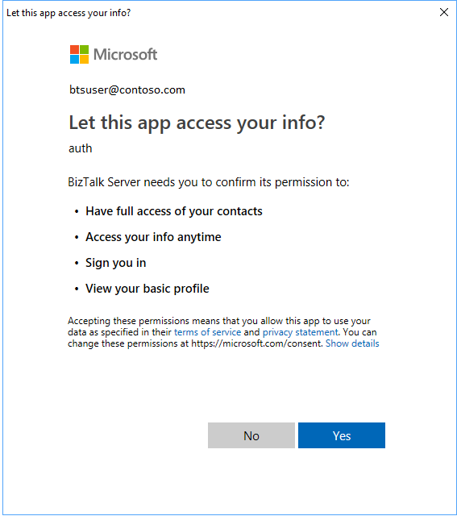

# Create a contact using the Office 365 Outlook Contact adapter - BizTalk Server

Use the Office 365 Outlook Contact adapter in BizTalk Server to create contacts in your Office 365 Outlook.

## Create a contact using a send port

1. In the BizTalk Server Administration console, right-click **Send Ports**, select **New**, and select **Static One-way send port**.

    [Create a Send Port](../core/how-to-create-a-send-port2.md) provides some guidance.

2. Enter a **Name**. In **Transport**, set the **Type** to **Office 365 Outlook Contact**, and select **Configure**.

3. Select **Sign in …**, and sign in to your Office 365 Account. The account is auto-populated with your email address.

4. Allow BizTalk Server approval for permission to access:

    

5. Select **Ok** to save your changes.

### Test the send port

You can use a simple File receive port and location to create an event on your Office 365 Outlook Contact adapter.

1. Create a receive port using the File adapter. Within your receive location,  set the **Receive folder** to **C:\\Temp\\In\\**, and set the file mask to **\*.xml**.
2. In your Office 365 Outlook Contact adapter send port properties, set the **Filters** to `BTS.ReceivePortName == <Receive Port Name>`.
3. Paste the following into a text editor, and save the file as **Office365Contact.xml**. This is your sample message.

    ```xml
        <ns0:Contact xmlns:ns0="http://schemas.microsoft.com/BizTalk/Office365OutlookContacts/Send">
            <categories>categories_0</categories>
            <categories>categories_1</categories>
            <categories>categories_2</categories>
            <birthday>1999-05-31T13:20:00.000-05:00</birthday>
            <fileAs>fileAs_0</fileAs>
            <displayName>displayName_0</displayName>
            <givenName>givenName_0</givenName>
            <initials>initials_0</initials>
            <middleName>middleName_0</middleName>
            <nickName>nickName_0</nickName>
            <surname>surname_0</surname>
            <title>title_0</title>
            <yomiGivenName>yomiGivenName_0</yomiGivenName>
            <yomiSurname>yomiSurname_0</yomiSurname>
            <yomiCompanyName>yomiCompanyName_0</yomiCompanyName>
            <generation>generation_0</generation>
            <jobTitle>jobTitle_0</jobTitle>
            <companyName>companyName_0</companyName>
            <department>department_0</department>
            <officeLocation>officeLocation_0</officeLocation>
            <profession>profession_0</profession>
            <businessHomePage>businessHomePage_0</businessHomePage>
            <assistantName>assistantName_0</assistantName>
            <manager>manager_0</manager>
            <homePhones>homePhones_0</homePhones>
            <homePhones>homePhones_1</homePhones>
            <mobilePhone>mobilePhone_0</mobilePhone>
            <businessPhones>businessPhones_0</businessPhones>
            <businessPhones>businessPhones_1</businessPhones>
            <spouseName>spouseName_0</spouseName>
            <personalNotes>personalNotes_0</personalNotes>
            <children>children_0</children>
            <children>children_1</children>
            <children>children_2</children>
            <emailAddresses>
                <name>name_0</name>
                <address>address_0</address>
            </emailAddresses>
            <emailAddresses>
                <name>name_0</name>
                <address>address_0</address>
            </emailAddresses>
            <homeAddress>
                <city>city_0</city>
                <countryOrRegion>countryOrRegion_0</countryOrRegion>
                <postalCode>10000</postalCode>
                <state>state_0</state>
                <street>street_0</street>
            </homeAddress>
            <businessAddress>
                <city>city_0</city>
                <countryOrRegion>countryOrRegion_0</countryOrRegion>
                <postalCode>11111</postalCode>
                <state>state_0</state>
                <street>street_0</street>
            </businessAddress>
            <otherAddress>
                <city>city_0</city>
                <countryOrRegion>countryOrRegion_0</countryOrRegion>
                <postalCode>21222</postalCode>
                <state>state_0</state>
                <street>street_0</street>
            </otherAddress>
        </ns0:Contact>
    ```
    **The XML schema is provided as part of the SDK inside < BizTalk Installation Folder\\SDK\\Schemas >**

4. Start the File receive location and the Office 365 Outlook Contact adapter send port.
5. Copy **Office365Contact.xml** sample message into the receive folder (C:\\Temp\\In\\). The send port creates a contact in your Office 365 Outlook account based on the xml.

## Next steps
See all the [Office 365 adapters](office365-adapters.md).