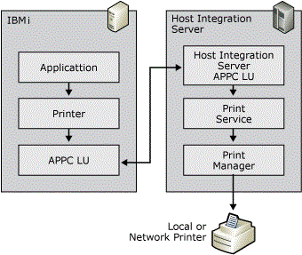

# APPC printing for IBM System i

APPC printing, like LU 1 printing, uses SCS control codes in the data stream. The set of SCS control codes available for use in APPC printing is more extensive, and allows more formatting options than the set described for LU 1 printing. The IBM System i also provides an additional method for formatting print jobs called Host Print Transform (HPT). With HPT enabled, the IBM System i takes responsibility for rendering the print job into data the printer can understand.  

The following diagram shows the APPC connection between IBM System i and Host Integration Server for sending a print job to local printer:


 
## Host Print Transform (HPT)  

When the host uses SCS control codes to format the print output, a print emulator translates the SCS codes and characters into data that the printer can understand by using the Windows printer driver and Windows Print system. With HPT enabled, the IBM System i converts the data to printer control codes before sending the data to Host Integration Server. This output from the host requires no further processing after leaving the IBM System i. The print emulator's only responsibility is submitting the data to the printer.

HPT is enabled on the IBM System i in the Device description for the print session. When HPT is enabled, pre-rendered print jobs are sent to the Host Integration Server in marked ASCII Transparent (ATRN) sections using the SCS control code '0x03'. The ATRN control code provides the same function as the Transparent (TRN) control code detailed in the LU 1 printing section. ATRN indicates that the data is ASCII, should be handled as transparent, and not to convert from EBCDIC to ASCII.  

### Enable the host transform feature using the default 5224 print device  

1. Stop the print writer associated with the print device.

1. Vary off the print device.

1. Issue the following command:
  
   ```
   chgdevprt devd(<print device>) transform(*YES) mfrtypmdl(<LAN printer type>)
   ```  

   Common LAN printer types include: *HP4, \*HPIII, \*HPII, \*IBM4039. To see a complete list of available options, prompt (F4) on the MFRTYPMDL parameter.  
  
1. Vary on the print device.  
  
1. Start the print writer.  
  
   For more details on the Host Print Transform feature, see the "IBM System i Printer device programming" manual (SC41-3713), or the "IBM System i Printing IV" redbook (GG24-4389). Both are available from IBM.  
  
## SCS Codes

The SCS control codes are fully documented in the *IBM Host Print Guide* (document number SC31-7145). All of the SCS control codes fall within the range of '0x00'–'0x3F.' These codes range from single-byte codes, such as Subscript '0x38' to multiple-byte codes followed by several parameters, such as Set Horizontal Format '0x2BC1...'  

The following list includes some common SCS control codes used:

> [!NOTE]
> 
> In SCS control code, [L] is equal to length, and **(Abv)** represents one-byte parameters.

### ASCII Transparency (ATRN) — '0x03[L](P1\)(. . .)(Pn)'

This SCS control code indicates a section of data that is not scanned for SCS codes, but passed to the print output untouched. In addition, this control code indicates that the data is ASCII. The extent of the section of data is denoted by the length byte. With HPT jobs, the length byte will commonly be '0xFF'.  

**Example**  

030441424344  

03 — ATRN  

04 — length of 4  

41424344 — ASCII hexadecimal values for ABCD  

### SCS Control Code Formatted (Non-HPT)
  
If HPT is disabled in the Device description for the print session, SCS control codes will be used for the formatting of the print job. The SCS control codes, SHF, SVF, SLD, and SPD detailed earlier for LU 1 printing are also supported in APPC printing. Also commonly used in APPC printing is the SCS control code Presentation Position (PP) '0x34.' This control code allows the print position to be moved either horizontally or vertically, relative to the previous position or to an absolute position.  
  
The following table lists the four forms of the Presentation Position SCS control code:

| Presentation position SCS control code | Description |
|----------------------------------------|-------------|
| Absolute Horizontal Presentation Position (AHPP) '0x34C0(nn)' | nn — The column number to set the print position. <br><br>**Example** <br><br>34C00F <br><br>34C0 — AHPP <br><br>0F — column number 15 |
| Relative Horizontal Presentation Position (RHPP) '0x34C8(nn)' | nn — The number of columns to move from the current print position. <br><br>**Example** <br><br>34C80F <br><br>34C8 — RHPP <br><br>0F — 15 columns |
| Absolute Vertical Presentation Position (AVPP) '0x34C4(nn)' | nn — The line number to set the print position. <br><br>**Example** <br><br>34C40F <br><br>34C4 — AVPP <br><br>0F — line number 15 |
| Relative Vertical Presentation Position (RVPP) '0x344C(nn)' | nn — The number of lines to move from the current print position. <br><br>**Example** <br><br>344C0F <br><br>344C — RVPP <br><br>0F — 15 lines |

## Sample Host Data  

The following example shows sample data from a host along with an explanation of the data and resulting printout:
  
```  
2BC10684 01840542 2BC20642 04420A21   
34C404 C1C2C3C4 344C01 34C004 E6E7E8E9  
```  

The following table shows the resulting print output from the data with ABCD on top print line and WXYZ indented on lower line:

| Data | Interpretation |
|------|----------------|
| 2BC1068401840542 | SHF, 132 characters per line, LM 1, RM 132 |
| 2BC2064204420A21 | SVF, 66 lines per page, TM 4, BM 66 |
| 34C404 | AVPP sets print position to line 4 |
| C1C2C3C4 | EBCDIC hex values for ABCD |
| 344C01 | RVPP sets print position down one line |
| 34C004 | AHPP sets print position to column 4 |
| E6E7E8E9 | EBCDIC hex values for WXYZ |
 
## See also  

[Host Print Service (Operations)](host-print-service-operations-2.md)

